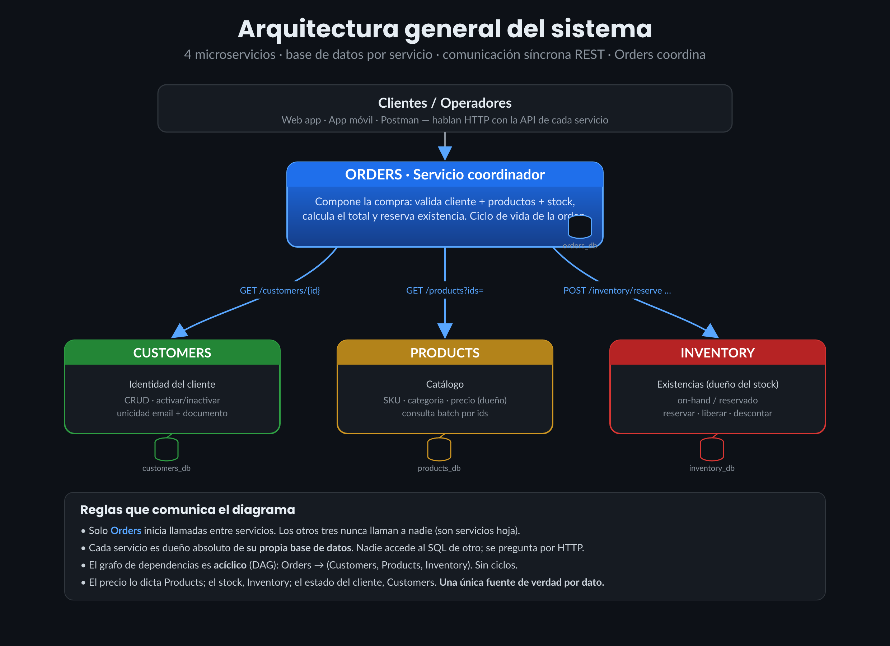
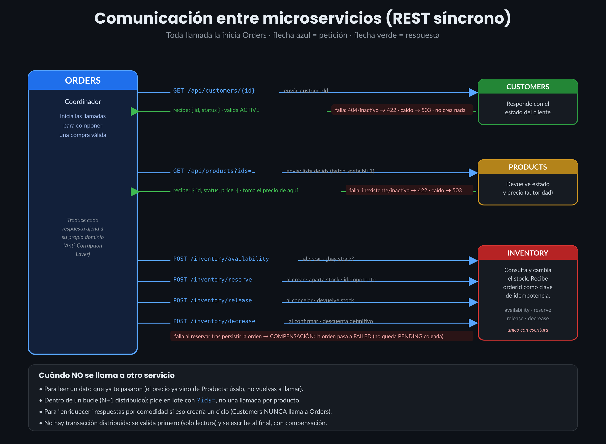
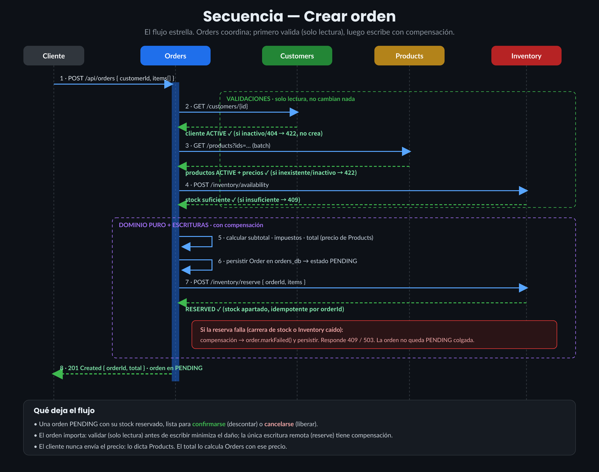
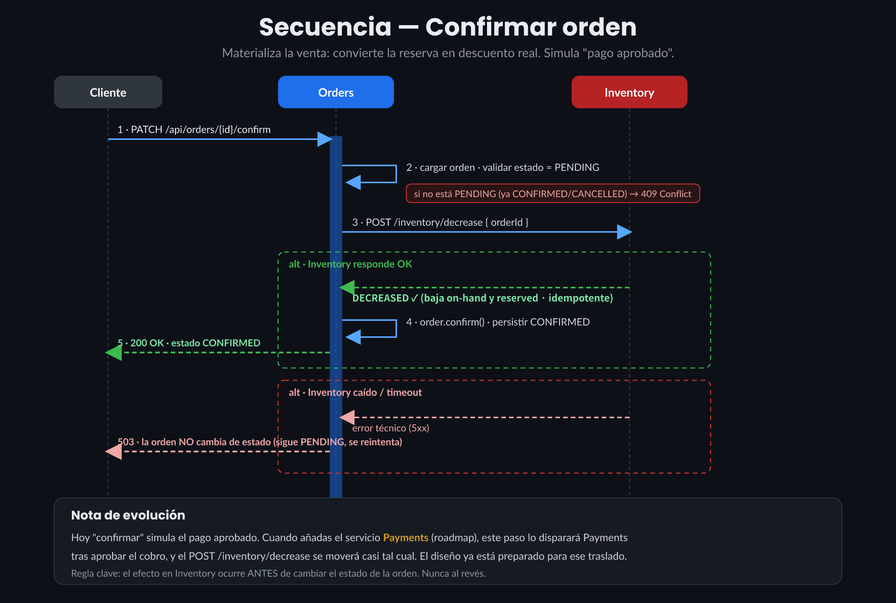
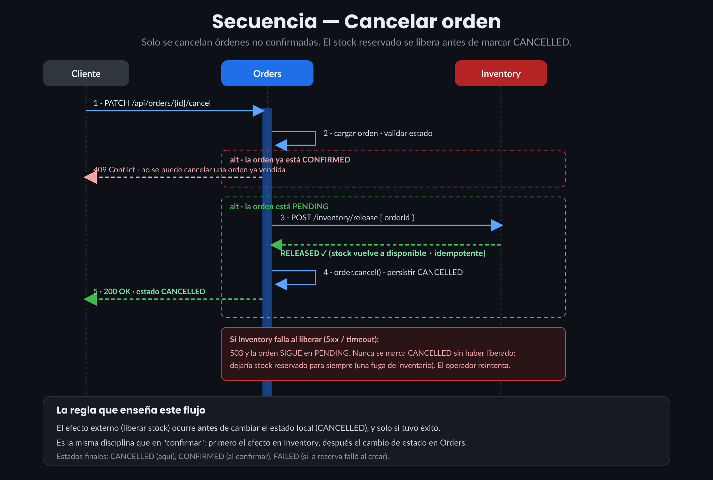
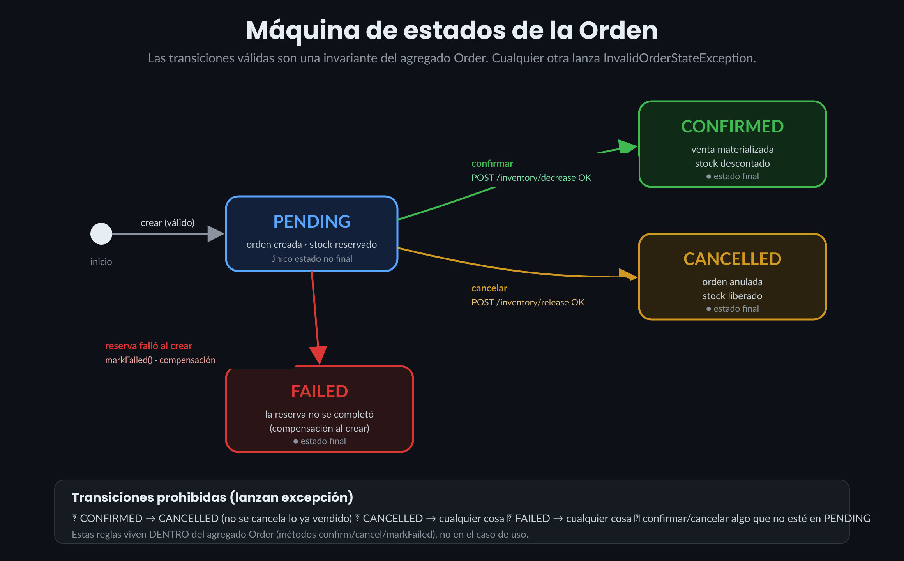
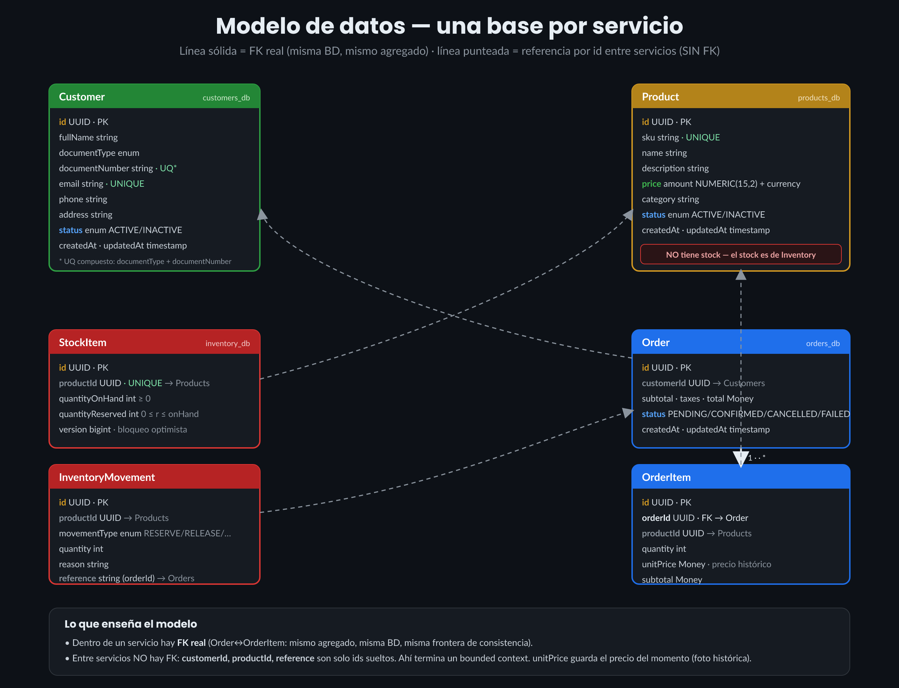
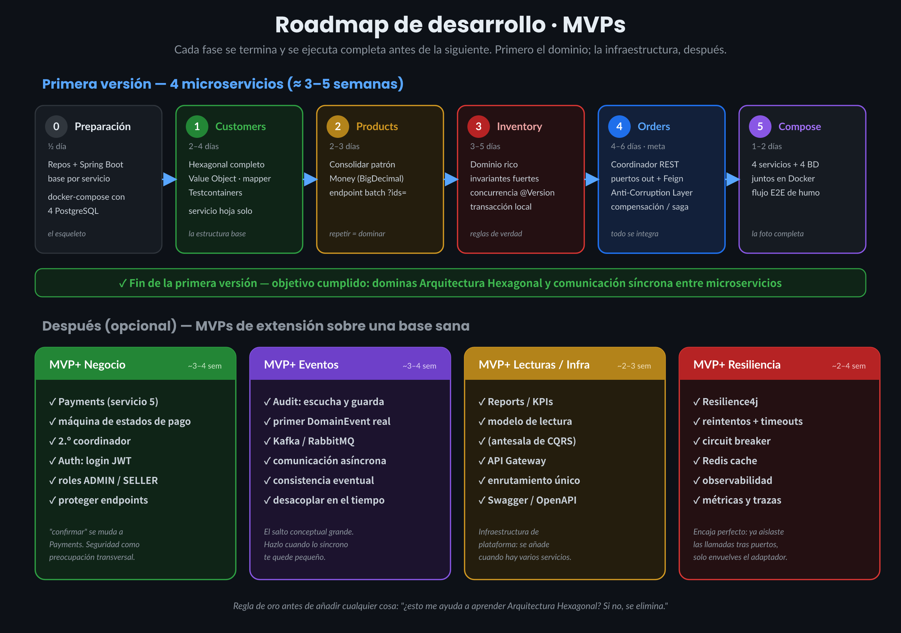

# OVERVIEW — Visión global del proyecto E-SHOP

> Documento de referencia principal durante todo el proyecto. Si un `REQUIREMENT.md` de un
> servicio entra en conflicto con este documento, este documento gana hasta que se decida y
> registre explícitamente un cambio aquí.

---

## 1. Visión funcional

### 1.1 Objetivo del sistema

Construir un **e-commerce mínimo** capaz de gestionar clientes, un catálogo de productos, el
stock de esos productos y las órdenes de compra que los relacionan. El flujo esencial: *"un
cliente arma una orden con varios productos, el sistema verifica que el cliente esté activo, que
los productos existan y estén disponibles, reserva el stock, calcula el total y deja la orden
registrada."*

El objetivo de negocio es usar el flujo de la arquitectura hexagonal para, resolver los problemas centrales de una arquitectura de microservicios hexagonal — modelar dominio, puertos/adaptadores, decidir cuándo un servicio debe llamar a
otro, mantener el desacoplamiento aunque los servicios se necesiten entre sí, y manejar el fallo de
una dependencia a mitad de una operación.

### 1.2 Problema de negocio

Una tienda en línea necesita, como mínimo: registrar y mantener **clientes** (email y documento
únicos), mantener un **catálogo** de productos con precio y categoría, saber cuánta **existencia**
hay de cada producto, y registrar **órdenes** calculando el total y evitando vender a clientes
inactivos, productos inexistentes o sin stock.

Estas cuatro necesidades tienen **dueños de datos distintos** y **razones de cambio distintas**:
el catálogo cambia por decisiones de marketing, el stock por logística, los clientes por
registro/soporte, las órdenes por ventas. Esa es la señal que, en DDD, justifica separarlas en
**bounded contexts** y, técnicamente, en microservicios.

### 1.3 Actores

| Actor | Qué hace en esta versión |
|-------|---------------------------|
| Cliente consumidor | Origina la creación de órdenes vía la API de `order-service`. No se autentica (Auth es roadmap). |
| Operador de catálogo | Crea/edita productos y precios (API de `product-service`). |
| Operador de inventario | Ajusta y repone stock (API de `inventory-service`). |
| Operador de clientes | Da de alta y mantiene clientes (API de `customer-service`). |
| **Los propios microservicios** | `order-service` actúa como cliente de los otros tres. Es el actor más relevante para el aprendizaje. |

Como Auth no existe todavía, cualquiera que llegue a un endpoint puede ejecutarlo. Es una
simplificación consciente: la seguridad es una preocupación transversal que se añade cuando el
dominio esté sólido.

### 1.4 Nota sobre Payments (fuera de alcance, pero previsto)

En el diagrama de negocio original, el pago dispara el descuento definitivo de stock. Con solo 4
servicios, ese "momento de confirmación" se modela como el caso de uso **"Confirmar orden"** dentro
de `order-service` (simula que el pago fue aprobado y descuenta el stock reservado). Cuando el
roadmap incorpore Payments, ese caso de uso se trasladará casi tal cual al nuevo servicio.

---

## 2. Visión técnica y alcance

### 2.1 Dentro de alcance (primera versión — 4 microservicios)

| Servicio | Cubre |
|----------|-------|
| `customer-service` | Alta, consulta, actualización, activación/inactivación de clientes; unicidad de email y documento. |
| `product-service` | Alta, consulta, actualización de datos y precio, activación/inactivación, búsqueda por categoría/SKU. **Sin stock.** |
| `inventory-service` | Dueño único del stock: existencia por producto, reservas, liberaciones, descuentos, historial de movimientos. |
| `order-service` | Coordinador: crea órdenes validando cliente/productos/stock, calcula totales, cancela liberando stock, confirma descontando stock, consulta órdenes. |

### 2.2 Fuera de alcance de esta versión (roadmap)

Payments (pago real o simulado), Auth (autenticación/roles), Audit (auditoría transversal),
Reports (reportes/KPIs), API Gateway, Service Discovery, Config Server, mensajería asíncrona
(Kafka), Event Sourcing, CQRS, Saga orquestada, Redis, Circuit Breaker/Resilience4j, Kubernetes,
Service Mesh, observabilidad (Prometheus/Grafana).

### 2.3 Por qué 4 servicios y no 8

El diagrama de negocio original contemplaba 8 servicios (Customers, Products, Orders, Payments,
Inventory, Auth, Audit, Reports). Se redujo a 4 porque:

- **Decisión:** implementar Customers, Products, Inventory y Orders ahora; dejar Payments, Auth,
  Audit y Reports para el roadmap.
- **Por qué:** estos cuatro cubren los dos patrones que importan para el aprendizaje —
  **servicio de dominio autónomo** (los tres primeros) y **servicio coordinador** (Orders). Auth,
  Audit y Reports no añaden un patrón *nuevo*: Auth es transversal, Audit es "escuchar y guardar",
  Reports es "leer y agregar" — se harían tres veces con la misma técnica ya aprendida.
- **Ventajas:** menos código repetido, menos servicios que levantar para probar un flujo, foco en
  lo que enseña.
- **Desventajas aceptadas:** no se ejercita seguridad ni auditoría desde el día uno; son capas que
  se añaden bien sobre un dominio ya limpio.
- **Alternativas descartadas:** los 8 de una vez (mucho código, poco aprendizaje marginal);
  empezar con un monolito modular (no enseñaría comunicación entre servicios, que es la mitad del
  objetivo del proyecto).

### 2.4 Un matiz honesto: ¿4 microservicios o monolito modular?

Para un sistema *real* de este tamaño, un monolito modular (un solo despliegue, módulos internos
con fronteras hexagonales) sería probablemente la mejor decisión de ingeniería: menos operación,
sin latencia de red, transacciones locales. Aquí se elige distribuir **no porque el negocio lo
exija, sino porque el aprendizaje lo exige** — el objetivo explícito es practicar comunicación
entre microservicios.

### 2.5 Diagrama lógico

Cuatro servicios, cada uno con su propia base de datos PostgreSQL (nunca comparten tablas):



`order-service`, y solo `order-service`, llama por REST a los otros tres: `GET
/api/customers/{id}` (¿el cliente existe y está activo?), `GET /api/products?ids=...` (¿los
productos existen, activos, a qué precio?), `POST /api/inventory/...` (consultar/reservar/liberar/
descontar stock).

> **Diagrama sugerido pendiente:** un DAG dedicado solo al grafo de dependencias (sin el detalle
> de responsabilidades de cada caja) podría ser útil como referencia rápida separada. No se genera
> todavía porque no fue solicitado ni entregado como imagen — el diagrama de arquitectura general
> de arriba ya cubre la misma información.

---

## 3. Arquitectura completa

### 3.1 Criterio de división: razones de cambio y dueño del dato

El error más común al diseñar microservicios es cortar por entidades ("una tabla, un servicio"),
lo que produce un enjambre de mini-CRUDs que terminan siendo un monolito distribuido. El criterio
correcto viene de DDD: se separa donde hay un **bounded context** — un área de negocio con
lenguaje propio, reglas propias y un dueño claro del dato, que cambia por razones independientes
de las demás.

- **Customers** cambia cuando cambian las reglas de "quién es un cliente válido". Dueño:
  registro/soporte.
- **Products** cambia cuando cambia el catálogo (precios, descripciones, categorías). Dueño:
  marketing/catálogo.
- **Inventory** cambia cuando cambia la logística. Dueño: almacén.
- **Orders** cambia cuando cambian las reglas de venta. Dueño: ventas.

### 3.2 Bounded context de cada servicio

| Servicio | Es dueño de | Lenguaje propio | Regla nuclear | NO le importa |
|----------|-------------|------------------|----------------|----------------|
| Customers | Identidad y estado comercial del cliente | Cliente, Documento, Email, Activo/Inactivo | Email y documento únicos; cliente inactivo no compra | Órdenes, productos, stock |
| Products | Descripción comercial y **precio** | Producto, SKU, Categoría, Precio | SKU único; producto inactivo no se vende; precio es autoridad de este servicio | Cuánto stock hay, órdenes |
| Inventory | Cuánto hay de cada producto y su historial | Existencia, En mano, Reservado, Disponible, Movimiento | `disponible = enMano − reservado`; nunca reservar más de lo disponible; cantidades nunca negativas | Precio, descripción, quién compra |
| Orders | La orden y su ciclo de vida | Orden, Línea de orden, Subtotal, Impuesto, Total, Estado | Solo se crea si cliente+productos+stock son válidos; total con precio de Products; solo se cancela si no está confirmada | — (depende de los otros tres) |

> **Decisión clave de modelado — dueño único del stock.** El diagrama de negocio original ponía
> `stock: int` dentro de `Product` **y además** existía un servicio `Inventory`: esto es un
> conflicto de propiedad del dato (dos servicios serían dueños de la misma verdad). **Resolución:**
> el stock pertenece solo a Inventory; `Product` no tiene campo `stock`. Es la aplicación directa
> del principio de única fuente de verdad (*single source of truth*).

### 3.3 Dependencias entre servicios

```
                    ─────────────► customer-service   (valida cliente activo)
   order-service ───┼────────────► product-service    (valida productos + precios)
   (coordinador)    └────────────► inventory-service   (consulta/reserva/libera/descuenta stock)

   customer-service, product-service, inventory-service  ───► (no dependen de nadie)
```

Grafo dirigido y acíclico (DAG): `order-service` apunta a los tres; nadie apunta de vuelta. Los
tres servicios hoja son autónomos: se desarrollan, arrancan, despliegan y prueban sin los demás.

### 3.4 Reglas de comunicación (las cinco reglas del sistema)

1. **Solo `order-service` inicia llamadas entre servicios.** Los servicios hoja jamás llaman a
   otro servicio.
2. **Nadie accede a la base de datos de otro.** Todo dato ajeno se pide por la API HTTP de su
   dueño. Cero SQL cruzado, cero tablas compartidas.
3. **El dueño del dato es la única autoridad sobre ese dato.** `order-service` nunca inventa ni
   cachea de forma autoritativa esos datos; los usa en el momento y guarda solo una **foto
   histórica** (ver 3.5).
4. **Comunicación síncrona REST/JSON.** Petición-respuesta. Sin eventos, sin colas, por ahora.
5. **Sin ciclos.** Si algún servicio hoja necesitara algo de `order-service`, no se resuelve
   haciendo que lo llame (crearía un ciclo); se resuelve con un evento futuro o repensando el
   límite. Esta versión no tiene esa necesidad.

### 3.5 Datos que Orders "copia" del cliente y del producto

Cuando `order-service` crea una orden, guarda en cada línea el `productId`, la `quantity` y el
`unitPrice` **del momento de la compra**. Ese precio es una **foto histórica**, no una copia
autoritativa: si `product-service` sube el precio después, las órdenes viejas conservan el precio
con el que se compraron. Esto no viola la regla 3 — `order-service` no se vuelve dueño del precio
"vivo", solo registra el valor que Products le dictó en ese instante. Es: *referencia por id + foto
de los datos relevantes al momento del evento de negocio*.

### 3.6 Cuándo SÍ y cuándo NO llamar a otro servicio

**Sí se justifica:**
- Necesitas un dato del que otro servicio es dueño y lo necesitas *ahora* para decidir (ej.
  ¿cliente activo? antes de crear la orden).
- Necesitas provocar un efecto en el dominio de otro servicio (ej. reservar stock).

**No se debe hacer:**
- Releer un dato que ya obtuviste o que ya te pasaron (si ya tienes el precio, no vuelvas a pedirlo
  para calcular el total).
- "Enriquecer" respuestas por comodidad (ej. que `customer-service` devuelva también las órdenes
  del cliente) — crea un ciclo y acopla el servicio hoja al coordinador. Esa composición la hace el
  cliente de la API o un futuro servicio de lectura/reportes.
- Llamar dentro de un bucle (**problema N+1 distribuido**). Si hay 10 productos, una sola llamada
  `GET /api/products?ids=...`, nunca 10 llamadas `GET /api/products/{id}`.
- Pedir un dato que ya viaja contigo (si `order-service` ya tiene el `customerId`, `inventory-
  service` no necesita preguntarle nada a `customer-service`).

### 3.7 Por qué REST síncrono y no eventos (todavía)

- **Decisión:** comunicación síncrona REST.
- **Por qué:** crear una orden necesita una respuesta inmediata ("¿se pudo o no?"); el usuario está
  esperando.
- **Ventajas:** fácil de razonar, fácil de depurar (traza lineal), sin infraestructura extra.
- **Desventajas:** acoplamiento temporal (si `inventory-service` está caído, no se puede crear la
  orden) y acoplamiento de disponibilidad (la disponibilidad de `order-service` es el producto de
  la disponibilidad de sus dependencias).
- **Alternativa futura:** eventos asíncronos (Kafka) desacoplarían en el tiempo, pero introducen
  consistencia eventual, mucho más difícil de razonar. Se deja para el roadmap porque enseñaría
  mensajería, no arquitectura hexagonal.

### 3.8 Responsabilidades: un solo dueño por regla

| Regla | Único dueño |
|-------|-------------|
| Validez del cliente | `customer-service` |
| Precio | `product-service` |
| Disponibilidad de stock | `inventory-service` |
| Cálculo del total y reglas de la orden | `order-service` |

Lo único "compartido" legítimo es el **contrato** (shape del JSON). Lo posee el servicio que
expone el endpoint; quien consume se adapta y traduce la respuesta ajena a sus propios objetos de
dominio en la capa de adaptador (**Anti-Corruption Layer**), sin dejar que el DTO ajeno se filtre
al dominio propio.

### 3.9 Manejo de errores entre servicios

Toda llamada de `order-service` a otro servicio puede fallar de tres formas, cada una con una
respuesta distinta:

| Tipo de fallo | Ejemplo | Qué hace `order-service` |
|---------------|---------|------------------------------|
| **Regla de negocio (4xx del otro servicio)** | Cliente no existe/inactivo; producto inactivo; sin stock | Traduce a error de negocio propio (422/409). **No crea nada.** |
| **Fallo técnico (5xx / timeout / conexión rechazada)** | El otro servicio está caído o tardó demasiado | Responde **503**. **No deja estado a medias.** |
| **Fallo después de un efecto ya aplicado** | La reserva se hizo, pero falla el guardado de la orden (o viceversa) | **Compensa**: deshace el efecto o marca la orden `FAILED`. |

**El problema central: no hay transacciones distribuidas.** En un monolito, "crear la orden" y
"reservar el stock" ocurrirían en una sola transacción de base de datos. Entre microservicios eso
no existe. Se garantiza la consistencia manualmente con dos técnicas:

1. **Ordenar operaciones para minimizar el daño:** primero todas las validaciones de solo lectura
   (cliente, productos, disponibilidad); solo si todo es válido se ejecutan las escrituras
   (persistir orden, reservar stock).
2. **Compensación explícita para las escrituras:** como se persiste la orden antes de reservar el
   stock, si la reserva falla queda una orden `PENDING` sin stock. La compensación es marcarla
   `FAILED`.

> Esto es una **saga en su forma más primitiva y manual** — una secuencia de pasos locales con
> compensación — pero sin framework de saga, sin orquestador, sin eventos: `try/catch` +
> llamada de compensación. Meter un framework de saga aquí sería sobreingeniería.

**Idempotencia:** la red miente — una llamada puede "fallar" por timeout aunque el otro servicio sí
la haya procesado. Las operaciones con efecto (sobre todo `reserve`) se diseñan idempotentes usando
el `orderId` como clave: si `order-service` reintenta, `inventory-service` reconoce que ya
reservó esa orden y no duplica. No se implementan reintentos automáticos todavía (Resilience4j es
roadmap), pero el diseño queda preparado para ellos.

### 3.10 Mapa de todas las comunicaciones



```
CREAR ORDEN
  order-service → customer-service   GET  /api/customers/{id}                (validar cliente activo)
  order-service → product-service    GET  /api/products?ids=...              (validar productos + precios)
  order-service → inventory-service  POST /api/inventory/availability        (verificar disponibilidad)
  order-service → inventory-service  POST /api/inventory/reserve             (reservar stock)

CANCELAR ORDEN
  order-service → inventory-service  POST /api/inventory/release             (liberar reserva)

CONFIRMAR ORDEN
  order-service → inventory-service  POST /api/inventory/decrease            (descontar stock reservado)
```

`customer-service` y `product-service` solo participan con lecturas (GET). `inventory-service`
participa con escrituras (`reserve`/`release`/`decrease`) porque una orden cambia el estado del
stock.

### 3.11 Tabla resumen de manejo de fallos por llamada

| Comunicación | Fallo de negocio (4xx) | Respuesta | Fallo técnico (5xx/timeout) | Respuesta | ¿Compensa? |
|--------------|------------------------|-----------|------------------------------|-----------|------------|
| → customer-service (validar) | cliente no existe/inactivo | 422 | sí | 503 | No (nada escrito) |
| → product-service (validar) | producto no existe/inactivo | 422 | sí | 503 | No |
| → inventory-service (availability) | stock insuficiente | 409 | sí | 503 | No |
| → inventory-service (reserve) | stock insuficiente (carrera) | 409 + orden FAILED | sí | 503 + orden FAILED | **Sí** |
| → inventory-service (release) | reserva ya liberada (OK idempotente) | — | sí | 503, orden sigue PENDING | No cambia estado |
| → inventory-service (decrease) | — | — | sí | 503, orden sigue PENDING | No cambia estado |

### 3.12 Diagramas de secuencia por operación

El detalle completo de payloads, códigos HTTP y casos de uso de cada operación se especificará en
`spec/order-service/REQUIREMENT.md`. Estos tres diagramas ya fijan el contrato de comportamiento
esperado:

**Crear orden** — el flujo estrella: valida (solo lectura) antes de escribir; la única escritura
remota (`reserve`) tiene compensación.



**Confirmar orden** — el efecto en `inventory-service` (`decrease`) ocurre antes de cambiar el
estado de la orden a `CONFIRMED`, nunca al revés.



**Cancelar orden** — misma disciplina: liberar el stock antes de marcar `CANCELLED`. Una orden ya
`CONFIRMED` no se puede cancelar (409).



### 3.13 Ciclo de vida de la orden (máquina de estados)

Las transiciones válidas son una invariante del agregado `Order` (viven en sus métodos
`confirm()`/`cancel()`/`markFailed()`, no en el caso de uso): solo `PENDING → CONFIRMED`,
`PENDING → CANCELLED` y `PENDING → FAILED`. Cualquier otra transición (confirmar una `CANCELLED`,
cancelar una `CONFIRMED`) lanza `InvalidOrderStateException`.



### 3.14 Modelo de datos global

Vista de conjunto de las cinco tablas principales repartidas en las 4 bases de datos. Línea sólida
= FK real (misma base de datos, mismo agregado); línea punteada = referencia por id entre
servicios, sin FK — así es exactamente donde termina cada bounded context.



El detalle columna por columna (tipos SQL, índices, restricciones `CHECK`) se especifica por
servicio en su `spec/<servicio>/REQUIREMENT.md`.

### 3.15 Resumen de decisiones de arquitectura

| Decisión | Elección | Motivo |
|----------|----------|--------|
| Número de servicios | 4 (no 8) | Cubren todos los patrones sin repetición inútil |
| Dueño del stock | Solo `inventory-service` | Única fuente de verdad; evita datos contradictorios |
| Comunicación | REST síncrono | El flujo de compra necesita respuesta inmediata |
| Base de datos | Una por servicio | Independencia real; sin tablas compartidas |
| Quién orquesta | `order-service` | Un solo lugar donde vive el flujo de venta |
| Grafo de dependencias | DAG, solo `order-service` sale | Sin ciclos = sistema comprensible |
| Consistencia | Validar-luego-escribir + compensación manual | No hay transacción distribuida; se maneja a mano |
| Gateway/Discovery/Config | Ninguno | Infraestructura que no enseña hexagonal. Roadmap |
| Versión de Java | **17** | LTS, coincide con el módulo `customer-service` ya creado |
| Convención de nombres de módulo | **singular + `-service`** | Coincide con el módulo físico ya existente en el repo |

---

## 4. Principios de Arquitectura Hexagonal

La Arquitectura Hexagonal (*Ports and Adapters*, Alistair Cockburn) parte de una idea simple: **la
lógica de negocio no debe saber que existe una base de datos, ni HTTP, ni Spring.** Se organiza en
tres anillos concéntricos:

- **Dominio (centro):** reglas de negocio puras — entidades, *value objects*, invariantes. Sin
  Spring ni JPA. Si mañana cambia PostgreSQL por otra base, este anillo no se toca.
- **Aplicación (medio):** casos de uso que orquestan el dominio para cumplir una intención del
  usuario. Definen **puertos**: interfaces que dicen *qué* necesitan del exterior, sin decir *cómo*.
  - *Puerto de entrada (in):* interfaz que expone el caso de uso (la llama el controlador REST).
  - *Puerto de salida (out):* interfaz que el caso de uso necesita (ej. "guardar un cliente"),
    implementada por fuera.
- **Adaptadores / Infraestructura (borde):** conexiones con el mundo real. El controlador REST es
  un adaptador de entrada; el repositorio JPA, uno de salida. Aquí vive Spring, JPA, Feign.


**Regla de dependencia (lo único que hay que memorizar):** las dependencias apuntan **hacia
adentro**. El borde conoce al centro; el centro nunca conoce al borde. Un caso de uso depende de
una interfaz (puerto de salida) que él mismo declara; el adaptador la implementa. Es inversión de
dependencias (la "D" de SOLID) — Spring solo inyecta la implementación correcta en el arranque.

Estructura de paquetes por servicio (ver también convención en `README.md`):

```
com.shop.<servicio>.service/
├── domain/
│   ├── model/          # Agregados, entidades, value objects — SIN imports de Spring o JPA
│   ├── event/          # DomainEvents (records inmutables) — hoy solo se registran/loguean
│   └── exception/       # Excepciones de dominio (unchecked)
├── application/
│   ├── port/
│   │   ├── in/          # Interfaces de casos de uso (inbound ports)
│   │   └── out/          # Interfaces de repositorios y externos (outbound ports)
│   └── usecase/          # Implementaciones de los casos de uso (@Service)
├── adapter/
│   ├── in/
│   │   └── web/          # @RestController, DTOs, GlobalExceptionHandler, mappers
│   └── out/
│       ├── persistence/  # @Entity JPA, JpaRepository, PersistenceAdapter, mappers
│       ├── messaging/     # Publicadores de eventos (futuro Kafka) — hoy no-op o log
│       └── feign/         # Clientes Feign a otros servicios (solo order-service)
└── config/                # BeanConfiguration, OpenApiConfig
```

Solo `order-service` tendrá el paquete `adapter/out/feign` y puertos de salida hacia **otros
servicios** (no solo hacia la base de datos) — `CustomerValidationPort`, `ProductCatalogPort`,
`InventoryPort` — cada uno implementado por un adaptador Feign que traduce las respuestas HTTP
ajenas al lenguaje de dominio de `order-service` (**Anti-Corruption Layer**): si el cliente está
inactivo, el adaptador lanza una excepción de dominio propia, nunca deja escapar un DTO ajeno ni
una `FeignException`.

---

## 5. Estrategia de pruebas (aplica a los 4 servicios)

### Qué mockear y qué no (regla general del proyecto)

- **Mockear:** los puertos de salida (repositorios, clientes externos) en las pruebas de casos de
  uso.
- **No mockear:** el dominio (entidades, value objects) — se usa real; es el núcleo que se quiere
  proteger.
- **No mockear:** la base de datos en pruebas de integración de persistencia — se usa
  **Testcontainers** con PostgreSQL real, nunca H2 (se comporta distinto ante restricciones y
  tipos).

### Niveles de prueba

| Nivel | Qué cubre | Herramientas |
|-------|-----------|--------------|
| Unitarias de dominio | Invariantes de entidades y value objects (ej. `reserve()` rechaza reservar más de lo disponible) | JUnit 5, sin mocks |
| Unitarias de casos de uso | Orquestación: se mockean los puertos de salida, se verifica el flujo y los caminos de error | JUnit 5 + Mockito |
| Integración de persistencia | Adaptador JPA contra PostgreSQL real, incluidas violaciones de restricciones únicas/`CHECK` | Testcontainers |
| Integración web | Códigos HTTP y mapeo de excepciones a respuestas | `@WebMvcTest` / `MockMvc`, o `@SpringBootTest` |
| Integración de adaptadores Feign (solo `order-service`) | Traducción de respuestas HTTP ajenas a excepciones de dominio propio, sin levantar el servicio real | WireMock |
| End-to-end (opcional, fase avanzada) | Flujo completo con los 4 servicios reales en Docker Compose | Docker Compose |

### Cobertura mínima recomendada

- Dominio + casos de uso: **≥ 90%** (en `inventory-service` y en `CreateOrderService` de
  `order-service`, ≥ 95% por ser el núcleo de valor de cada uno).
- Global por servicio: **~80%**. No perseguir el 100%: el mapeo trivial y la configuración no
  justifican el esfuerzo — la cobertura es un medio, no un fin.

---

## 6. Convenciones transversales

- **Formato de errores HTTP:** cada servicio traduce excepciones de dominio a códigos HTTP con su
  propio `GlobalExceptionHandler` (`@RestControllerAdvice`). Criterio general: 200 OK
  lecturas/actualizaciones; 201 Created altas; 400 datos mal formados; 404 recurso inexistente; 409
  conflicto (unicidad, estado inválido, stock insuficiente); 422 regla de negocio violada por una
  dependencia (cliente/producto inválido); 503 dependencia caída o con timeout.
- **Dónde va cada validación:** *forma* del dato (¿es un email bien escrito?) → adaptador web/DTO
  con Bean Validation. *Regla de negocio* (¿es único? ¿puede desactivarse?) → dominio/casos de uso.
  No mezclar: reglas de negocio en el controlador dejan al dominio no confiable por sí solo.
- **Llamadas en lote, nunca N+1 distribuido:** todo endpoint que otro servicio vaya a consultar en
  serie para varias líneas debe diseñarse para lote (ej. `GET /api/products?ids=...`).
- **Duplicación controlada de value objects simples (ej. `Money`):** se acepta duplicar un VO
  pequeño en cada servicio en vez de compartir una librería común entre ellos — compartir código
  acoplaría servicios que deben poder evolucionar independientemente. En microservicios, un poco de
  duplicación es preferible al acoplamiento.

---

## 7. Roadmap completo

La regla del roadmap: **cada fase se termina y se ejecuta completa antes de empezar la
siguiente.** Terminar una fase significa: compila, corre en Docker, tiene sus pruebas verdes y fue
probada con Postman/curl.



```
Fase 0  Preparación
Fase 1  customer-service solo (hexagonal completo, sin llamar a nadie)
Fase 2  product-service solo (consolidar el patrón)
Fase 3  inventory-service solo (dominio rico, invariantes, concurrencia)
Fase 4  order-service coordinador (integración: REST + compensación)
Fase 5  Docker Compose: sistema completo + prueba E2E
─────────── fin de la primera versión (objetivo del proyecto) ───────────
Fase 6+ Extensiones opcionales (Payments, Auth, Audit, Reports, Gateway, eventos…)
```

### Fase 0 — Preparación

Proyecto base Spring Boot por servicio (Java 17), dependencias: Web, Data JPA, driver PostgreSQL,
Validation, MapStruct (y OpenFeign solo en `order-service`). `docker-compose.yml` con 4 PostgreSQL
desde el inicio. Convención de paquetes hexagonal creada vacía en `customer-service` como
plantilla. **Done cuando:** cada servicio arranca "vacío" y se conecta a su PostgreSQL en Docker.

### Fase 1 — customer-service (el corazón del aprendizaje hexagonal)

Dominio (`Customer`, VO `Email`, enums, excepciones) con pruebas unitarias primero. Puertos in/out.
Casos de uso con pruebas (mock del puerto out). Adaptador web + adaptador de persistencia con
pruebas de integración (Testcontainers), incluida la violación de restricciones únicas. **Done
cuando:** CRUD + activar/inactivar + listar por HTTP; pruebas verdes; cobertura dominio+casos de
uso ≥ 90%.

### Fase 2 — product-service (consolidación)

Mismo esqueleto que Fase 1. Foco nuevo: VO `Money` (`BigDecimal`, nunca `double`); endpoint batch
`GET /api/products?ids=...` pensado para `order-service`; operación de precio separada de la
actualización de datos generales. **Done cuando:** catálogo operativo por HTTP, batch funcionando,
pruebas verdes.

### Fase 3 — inventory-service (dominio rico y concurrencia)

Dominio `StockItem` con `reserve/release/decrease/restock/adjust` y sus invariantes (`0 <=
reserved <= onHand`) — el foco de pruebas unitarias más importante del proyecto. `InventoryMovement`
como agregado de historial separado. Casos de uso `@Transactional` (atomicidad local) e
idempotencia por `orderId`. Concurrencia con bloqueo optimista (`@Version`) + prueba de integración
concurrente. `CHECK` constraints en la base de datos. **Done cuando:** reserva
atómica e idempotente; test de concurrencia demuestra que no hay sobreventa; cobertura de dominio
≥ 95%.

### Fase 4 — order-service coordinador (la meta del proyecto)

No se hace de un golpe:

1. Dominio primero, sin red: `Order`, `OrderItem`, `Money`, `OrderStatus` con máquina de estados.
   Pruebas de cálculo de totales y transiciones.
2. Puertos de salida hacia servicios: `CustomerValidationPort`, `ProductCatalogPort`,
   `InventoryPort`.
3. `CreateOrderService` con los cuatro puertos mockeados — coordinador completo, incluida
   compensación, probado sin levantar ningún otro servicio.
4. Adaptadores Feign + Anti-Corruption Layer (traducción 404→NotValid, 5xx→Unavailable), probados
   con WireMock.
5. Persistencia de `Order` + `OrderItem` (Testcontainers).
6. Cancelar y confirmar (release/decrease con la regla "efecto antes que cambio de estado").
7. Timeouts de Feign configurados explícitamente; mapeo de excepciones a 503 en el
   `GlobalExceptionHandler`.

**Done cuando:** con los tres servicios corriendo, se puede crear una orden real (valida cliente,
toma precios, reserva stock), cancelarla (libera) y confirmarla (descuenta); cobertura de
`CreateOrderService` ≥ 90%.

### Fase 5 — Sistema completo en Docker Compose

Los 4 servicios + 4 PostgreSQL levantándose juntos, URLs por variables de entorno. Flujo de humo:
crear cliente → crear producto → reponer stock → crear orden → confirmarla → verificar que el
stock bajó. **Aquí termina la primera versión y se cumple el objetivo del proyecto.**

### Fase 6+ — Extensiones opcionales

No obligatorias, no en orden fijo — elegir según qué se quiera aprender, aplicando siempre la
regla de oro antes de añadir algo:

| Extensión | Qué añade al aprendizaje |
|-----------|---------------------------|
| Payments (servicio 5) | Mover "confirmar" a un servicio propio; segundo coordinador |
| Auth (JWT/roles) | Preocupación transversal sin ensuciar el dominio |
| Audit | Servicio que escucha y guarda — excusa perfecta para el primer evento |
| Reports/KPIs | Lecturas y agregaciones — antesala de CQRS |
| Eventos (Kafka/RabbitMQ) | Comunicación asíncrona y consistencia eventual |
| API Gateway | Punto único de entrada — operación, no dominio |
| Resiliencia (Resilience4j) | Reintentos, circuit breaker sobre las llamadas de `order-service` |
| Observabilidad | Logs estructurados, métricas, trazas distribuidas |

### Checklist de "¿de verdad terminé una fase?"

- [ ] Compila y arranca en Docker contra su PostgreSQL.
- [ ] Dominio y casos de uso con pruebas unitarias verdes.
- [ ] Adaptadores con pruebas de integración (Testcontainers/WireMock) verdes.
- [ ] Probado a mano con curl/Postman (casos felices y de error).
- [ ] Cobertura en el rango recomendado.
- [ ] Se puede explicar cada decisión de esa fase sin mirar los apuntes.

---

## 8. Decisiones registradas en esta revisión

| # | Tema | Decisión | Origen |
|---|------|----------|--------|
| D-1 | Versión de Java | 17 (no 23 como decía la documentación original) | Ya implementado en `customer-service`; confirmado por el usuario |
| D-2 | Nombre de módulos | Singular + `-service` (`customer-service`, `product-service`, `inventory-service`, `order-service`) | Coincide con el módulo físico ya existente; confirmado por el usuario |
| D-3 | Paquete raíz Java | `com.shop.<servicio>.service` (no `com.ecommerce.<servicio>` como decía la documentación original) | Deriva de D-2 y del código ya existente |
| D-4 | Nombres de bounded context vs. módulo técnico | Se mantiene el lenguaje de dominio en plural (Customers, Products, Inventory, Orders) para la documentación de negocio, distinto del nombre técnico del módulo | Evita confundir "cómo se llama el concepto de negocio" con "cómo se llama la carpeta/paquete" |
| D-5 | Formato de paginación | Sobre propio `{ content, page, size, totalElements, totalPages }`, no el `Pageable`/`Page` de Spring serializado tal cual | Resuelto en `customer-service/REQUIREMENT.md`; aplica a todos los servicios por consistencia |
| D-6 | Generación de `UUID` | Se genera en el dominio/aplicación, no delegada a la base de datos (`@GeneratedValue`/`DEFAULT`) | Coherente con que el dominio no dependa de JPA; resuelto en `customer-service/REQUIREMENT.md` |
| D-7 | Formato de timestamps | ISO-8601 en UTC (`"...Z"`) sobre columnas `TIMESTAMPTZ` | Resuelto en `customer-service/REQUIREMENT.md`; aplica a todos los servicios |

## 9. Mejoras sugeridas (pendientes de aprobación, no aplicadas)

Estas ideas se señalan por transparencia, tal como pide la metodología de trabajo, pero **no se
incorporan a la especificación** hasta que se aprueben explícitamente — no modifican el diseño
original entregado:

- **Formato de error estandarizado entre los 4 servicios** (ej. `ProblemDetail` / RFC 7807) en vez
  de que cada `GlobalExceptionHandler` defina su propio shape de JSON de error. Bajo costo ahora,
  alto costo si se retrasa (cada consumidor de las 4 APIs ya se habría acoplado a shapes distintos).
- **Cabecera de correlación (`X-Correlation-Id` o similar)** propagada por `order-service` en sus
  tres llamadas salientes, para poder rastrear una operación de "crear orden" a través de los logs
  de los 4 servicios sin necesitar trazas distribuidas completas (que sí están, correctamente,
  fuera de alcance).
- **Ajuste del `pom.xml` de `customer-service`** para reflejar formalmente en el `<description>` o
  metadata del proyecto que sigue la convención `com.shop.<servicio>.service` — hoy es correcto
  mecánicamente pero no está documentado como convención hasta este OVERVIEW.

## 10. Riesgos generales del proyecto

- **Alcance educativo vs. presión de "hacerlo production-ready":** la tentación de adelantar
  Fase 6+ (seguridad, resiliencia) antes de dominar lo hexagonal diluye el aprendizaje. Mitigación:
  la regla de oro y el checklist de fin de fase.
- **Duplicación de `Money` y otros VOs pequeños entre servicios** podría tentar a extraer una
  librería compartida; hacerlo acoplaría el versionado de los 4 servicios. Se documenta
  explícitamente como decisión consciente (sección 6).
- **Ventana de inconsistencia entre persistir la orden y reservar el stock** (orden `PENDING` sin
  reserva confirmada, por diseño). Aceptada y mitigada con compensación (`FAILED`), no eliminada.

## 11. Decisiones pendientes (a resolver cuando se especifique cada servicio)

- Shape exacto del cuerpo de error HTTP (ver mejora sugerida en `§9`, RFC 7807 aún no aprobado).
- Tamaño de página por defecto y máximo permitido en los listados paginados de `product-service`,
  `inventory-service` y `order-service` (para `customer-service` ya está resuelto: default `20`,
  máximo `100` — ver `customer-service/REQUIREMENT.md §13`; se recomienda replicar estos mismos
  valores por consistencia salvo que un servicio tenga una razón concreta para diferir).
- Si `inventory-service` expone `restock`/`adjust` sin autenticación en esta fase (heredado del
  punto 1.3: sí, por ahora, igual que el resto de endpoints).

> Resueltas: formato de paginación, generación de `UUID` y formato de timestamps — ver D-5, D-6,
> D-7 en `§8`.
