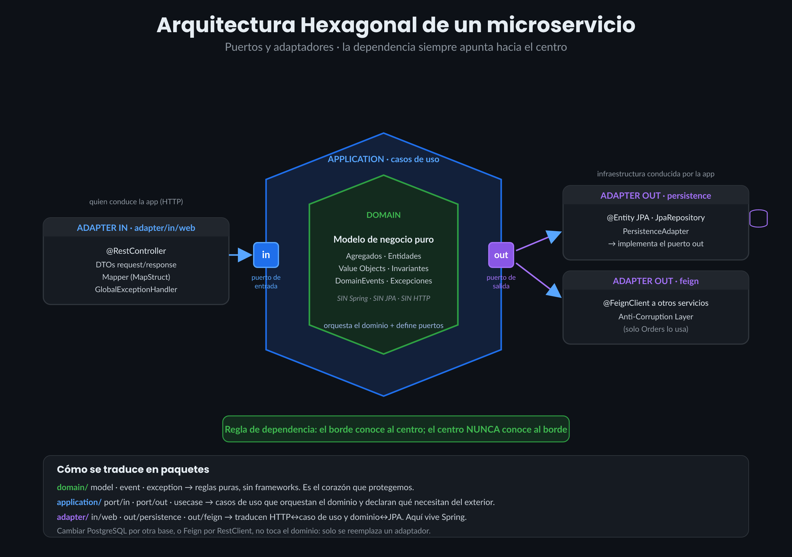

# Requerimiento — `customer-service`

> Bounded context de negocio: **Customers** ("Identidad del cliente"). Módulo técnico:
> `customer-service` (ya existe como esqueleto Spring Boot en la raíz del repo). Es el servicio más
> simple del sistema — no llama a nadie — por eso es el primero en implementarse (Fase 1 del
> roadmap en `../OVERVIEW.md`).
>
> Traducción de convenciones aplicada a este documento respecto a la fuente original: paquete raíz
> `com.shop.customer.service` (no `com.ecommerce.customers` — ver decisión D-3 en `../OVERVIEW.md
> §8`); carpeta `spec/customer-service/` (no `spec/customer/` — ver decisión D-2).

---

## 1. Objetivo

Ser la **única fuente de verdad** sobre quién es cada cliente y si está habilitado para operar.
Resuelve: *"registrar clientes sin duplicar emails ni documentos, y poder marcar a un cliente como
inactivo para que no pueda comprar, sin borrarlo (conservando su historia)."*

## 2. Problema que resuelve

`order-service` necesita, antes de crear cualquier orden, una respuesta autoritativa a "¿este
cliente existe y puede comprar?". Sin un servicio dueño de esa regla, cada consumidor reimplementaría
su propia noción de "cliente válido", con el riesgo de que diverjan. `customer-service` centraliza
esa regla y la expone por HTTP.

## 3. Alcance

**Dentro de esta especificación:** alta de clientes con unicidad de email y documento, consulta por
id y por documento, listado paginado, actualización de datos de contacto, activación/inactivación
(borrado lógico).

**Fuera de alcance (no se implementa aquí):**
- Autenticación, contraseñas o roles — "cliente" es un dato de negocio, no una credencial. Es
  responsabilidad del futuro servicio Auth (roadmap, ver `../OVERVIEW.md §7`).
- Borrado físico de clientes — rompería referencias históricas de órdenes ya creadas.
- Cualquier conocimiento de órdenes, productos o stock.

## 4. Responsabilidades

- Crear clientes garantizando unicidad de email y documento (`documentType` + `documentNumber`).
- Consultar un cliente por `id` y por número de documento.
- Listar clientes con paginación y filtro opcional por `status`.
- Actualizar datos de contacto de un cliente (incluido el email, con revalidación de unicidad).
- Activar / inactivar un cliente (borrado lógico, no físico).
- Exponer el `status` del cliente para que `order-service` lo consulte al crear una orden.

## 5. Qué NO hace

- **No** conoce órdenes, productos ni stock. Su dominio es exclusivamente el cliente.
- **No** llama a ningún otro servicio — es un servicio hoja (ver `../OVERVIEW.md §3.3`).
- **No** autentica ni gestiona contraseñas/roles.
- **No** borra físicamente clientes; usa `status = INACTIVE`.

---

## 6. Entidades y Value Objects

### 6.1 Agregado raíz `Customer`

**Composición** (atributos que forman el agregado):

```
Customer
├── id: UUID                        — identidad, inmutable
├── fullName: String                — nombre comercial
├── documentType: DocumentType      — enum, ver 6.2
├── documentNumber: String          — identificador legal
├── email: Email                    — value object, ver 6.3
├── phone: String (nullable)        — opcional
├── address: String (nullable)      — opcional
├── status: CustomerStatus          — enum, ver 6.2
├── createdAt: Instant              — inmutable
└── updatedAt: Instant
```

**Construcción — dos vías, sin constructor público mutable:**

- **Alta nueva — `Customer.create(fullName, documentType, documentNumber, email, phone?,
  address?)`:** factory method estático. Genera `id = UUID.randomUUID()` internamente, fija
  `status = ACTIVE` y `createdAt = updatedAt = Instant.now()`. Es el único punto que usa
  `CreateCustomerUseCaseImpl` (CU-1). Valida las invariantes de §13 en el propio constructor —
  construir un `Customer` inválido debe ser imposible.
- **Reconstrucción desde persistencia — `Customer.reconstruct(id, fullName, documentType,
  documentNumber, email, phone, address, status, createdAt, updatedAt)`:** factory method que
  recibe **todos** los campos, tal como vienen de la base de datos (incluido un `status` que puede
  ser `INACTIVE`). Lo usa exclusivamente `CustomerPersistenceMapper` al traducir un
  `CustomerJpaEntity` de vuelta a dominio. Ningún caso de uso lo invoca directamente.
- No hay setters públicos. Los únicos cambios posteriores a la construcción pasan por los métodos
  de dominio `activate()`, `deactivate()`, `updateContact(fullName, phone, address, email)`. Cada
  uno actualiza `updatedAt` **solo cuando produce un cambio real** (ver 6.2 sobre idempotencia).

**Atributos — detalle completo:**

| Atributo | Tipo | Por qué existe | Reglas de negocio |
|----------|------|-----------------|--------------------|
| `id` | `UUID` | Identidad única e inmutable, generada en el dominio (no en la BD) para que el agregado sea válido sin depender de JPA. | Inmutable tras `create()`/`reconstruct()`. |
| `fullName` | `String` | Nombre comercial mostrado en órdenes y comunicaciones. | Obligatorio, no vacío, 2–120 caracteres (ver §13). |
| `documentType` | `DocumentType` | Da contexto al número de documento (ver 6.2). | Obligatorio, valor del enum. |
| `documentNumber` | `String` | Identificador legal; clave natural de unicidad junto con `documentType`. | Obligatorio, alfanumérico, 5–20 caracteres. |
| `email` | `Email` | Canal de contacto y segunda clave natural de unicidad. | Ver VO `Email` (6.3). |
| `phone` | `String` | Contacto secundario. | Opcional; si viene, 7–20 caracteres. |
| `address` | `String` | Contacto/envío. | Opcional, máx. 200 caracteres. |
| `status` | `CustomerStatus` | Si el cliente puede comprar (lo consulta `order-service`). | Ver enum (6.2). |
| `createdAt` | `Instant` | Trazabilidad de alta. | Inmutable, fijado en `create()`/`reconstruct()`. |
| `updatedAt` | `Instant` | Trazabilidad del último cambio. | Se actualiza solo cuando un método de dominio produce un cambio real. |

### 6.2 Enums

**`CustomerStatus`** — `ACTIVE` \| `INACTIVE`
- Nace `ACTIVE` (fijado por `Customer.create()`).
- `activate()` fuerza `ACTIVE`; `deactivate()` fuerza `INACTIVE`.
- Ambos son **idempotentes por diseño**: invocarlos sobre un `Customer` que ya está en el estado
  pedido no lanza error **y no debe generar un nuevo `updatedAt`** — es responsabilidad de
  `ChangeCustomerStatusUseCaseImpl` verificar el estado actual antes de invocar el método de dominio y
  de persistir, para que la idempotencia sea real (sin efectos, no solo "sin excepción"). Ver
  CU-6/CU-7 y §15.2.
- No existen más estados; no hay "borrado", solo `INACTIVE`.

**`DocumentType`** — `CC` \| `NIT` \| `CE` \| `PASSPORT`
- `CC` — Cédula de ciudadanía. `NIT` — Número de Identificación Tributaria. `CE` — Cédula de
  extranjería. `PASSPORT` — Pasaporte.
- Enum cerrado: añadir un nuevo tipo de documento requiere una migración de este servicio, no es
  dato configurable en runtime.
- Un mismo `documentNumber` puede repetirse entre `documentType` distintos (un `CC` y un `NIT` con
  el mismo número no son el mismo documento); la unicidad es sobre el **par**
  `(documentType, documentNumber)`, nunca sobre `documentNumber` aislado.

### 6.3 Value Object `Email`

- **Por qué es un VO y no un `String`:** encapsula la regla "esto es un email válido y
  normalizado" en un solo lugar; tener un `Email` en el dominio garantiza que ya es válido — no hay
  que revalidar en cada método que lo use.
- **Composición:** envuelve un único campo interno `value: String`, ya normalizado.
- **Construcción — `Email.of(rawValue)`:** recorta espacios (`trim`), convierte a minúsculas,
  valida formato (`local@dominio.tld`, `@` obligatorio, dominio con al menos un `.`); si el
  resultado no es válido, lanza `InvalidEmailException` (ver 6.4).
- **Igualdad:** dos `Email` son iguales si su `value` normalizado coincide (`equals`/`hashCode` por
  valor) — así `Email.of("Ana@X.com")` y `Email.of("ana@x.com")` son el mismo valor para efectos de
  unicidad.
- **Inmutable:** sin setters; para "cambiar el email" de un cliente se construye un `Email` nuevo y
  se reemplaza vía `Customer.updateContact(...)`.

> **Nota didáctica (heredada de la fuente original):** empezar con un único VO (`Email`) es
> suficiente para fijar el patrón. `phone` y `address` se quedan como `String` con validación en el
> adaptador web — convertirlos en VO también sería sobreingeniería para lo que este servicio
> necesita hoy.

### 6.4 Excepciones de dominio asociadas

| Excepción | Se lanza cuando | HTTP |
|-----------|------------------|------|
| `InvalidEmailException` | `Email.of(...)` recibe un valor vacío o con formato inválido | 400 |
| `CustomerNotFoundException` | Un caso de uso busca un `Customer` por `id` o por documento y no existe | 404 |
| `DuplicateEmailException` | Se intenta crear/actualizar con un email ya usado por **otro** cliente | 409 |
| `DuplicateDocumentException` | Se intenta crear con un `(documentType, documentNumber)` ya usado | 409 |

---

## 7. Casos de uso

Cada caso de uso es una clase en `application/usecase` que implementa un puerto de entrada de
`application/port/in`.

### CU-1 · Crear cliente

- **Objetivo:** registrar un nuevo cliente válido y único.
- **Flujo principal:**
  1. Se reciben `fullName`, `documentType`, `documentNumber`, `email`, `phone?`, `address?`.
  2. Se construye el VO `Email` (normaliza trim + minúsculas; valida formato).
  3. Se verifica, vía puerto de salida, que no exista otro cliente con ese email — **primero**.
  4. Se verifica que no exista otro cliente con ese `documentType` + `documentNumber` — segundo,
     solo si el paso 3 pasó.
  5. Se construye el agregado con `Customer.create(...)` (nace `ACTIVE`, con timestamps).
  6. Se persiste el cliente.
  7. Se devuelve el `Customer` creado, con su `id`.
- **Flujos alternativos:**
  - Email ya registrado → `DuplicateEmailException`; no se llega a comprobar el documento; no se
    crea nada.
  - Documento ya registrado (email libre) → `DuplicateDocumentException`; no se crea nada.
  - Campos obligatorios ausentes o email mal formado → rechazado en el adaptador web (Bean
    Validation) antes de invocar el caso de uso; si de todos modos llegara al dominio,
    `Customer.create()`/`Email.of()` lo rechazan igual.
- **Validaciones:** ver §13.
- **Errores:** `DuplicateEmailException` (409), `DuplicateDocumentException` (409),
  `ValidationException`/`InvalidEmailException` (400).
- **Resultado esperado:** `Customer` persistido con `status=ACTIVE`, respuesta 201 Created.

### CU-2 · Consultar cliente por id

- **Objetivo:** obtener los datos de un cliente. **Es el caso de uso que consume `order-service`.**
- **Flujo principal:** recibe `id` → busca en el repositorio → devuelve el `Customer`.
- **Flujos alternativos:** `id` no existe → se propaga el error, nada más ocurre.
- **Validaciones:** ninguna de negocio (la existencia se resuelve como resultado).
- **Errores:** `CustomerNotFoundException` (404).
- **Resultado esperado:** 200 con el `Customer` completo (incluye `status`).

### CU-3 · Buscar cliente por documento

- **Objetivo:** localizar un cliente por su documento (soporte/registro).
- **Flujo principal:** recibe `documentType` + `documentNumber` → busca por el **par** exacto →
  devuelve el `Customer`.
- **Validaciones:** ambos parámetros presentes.
- **Errores:** `CustomerNotFoundException` (404).
- **Resultado esperado:** 200 con el `Customer`.

### CU-4 · Listar clientes (paginado)

- **Objetivo:** listar clientes para administración.
- **Flujo principal:** recibe `page`, `size`, `status?` → ejecuta consulta paginada → devuelve
  página + metadatos.
- **Flujos alternativos:**
  - `page`/`size` fuera de los límites de §13 → rechazo antes del caso de uso.
  - `page` más allá del total de páginas existentes → **no** es un error: se devuelve una página
    con `content` vacío.
- **Validaciones:** paginación válida (ver §13).
- **Errores:** `ValidationException` (400).
- **Resultado esperado:** 200 con `{ content, page, size, totalElements, totalPages }`.

### CU-5 · Actualizar datos del cliente

- **Objetivo:** modificar datos de contacto (nombre, teléfono, dirección, email).
- **Flujo principal:**
  1. Recibe `id` + campos a actualizar.
  2. Carga el agregado; si no existe, error.
  3. Si el email cambia, revalida unicidad **excluyendo el propio id del cliente** de la
     comprobación.
  4. Aplica los cambios mediante `customer.updateContact(...)`.
  5. Persiste (solo si hubo cambio real).
- **Flujos alternativos:**
  - Nuevo email usado por **otro** cliente → `DuplicateEmailException`; no se aplica ningún cambio
    (ni siquiera los demás campos de la misma petición).
  - Nuevo email igual al que ya tenía el cliente → **no falla** (la exclusión del propio id evita
    un falso positivo de duplicado).
- **Validaciones:** cliente existe; email (si cambia) sigue siendo único **excluyendo al propio
  cliente**.
- **Errores:** `CustomerNotFoundException` (404), `DuplicateEmailException` (409),
  `ValidationException` (400).
- **Resultado esperado:** 200 con el `Customer` actualizado.

### CU-6 · Inactivar cliente

- **Objetivo:** deshabilitar a un cliente para que no pueda comprar, sin borrarlo.
- **Flujo principal:**
  1. Carga el cliente.
  2. Si `status` ya es `INACTIVE`, devuelve el cliente tal cual **sin llamar a `save`** (idempotente
     real, ver 6.2).
  3. Si `status` es `ACTIVE`, invoca `customer.deactivate()` y persiste.
- **Validaciones:** cliente existe.
- **Errores:** `CustomerNotFoundException` (404).
- **Resultado esperado:** 200 con `status=INACTIVE`.

### CU-7 · Activar cliente

- **Objetivo:** rehabilitar a un cliente inactivo.
- **Flujo principal:** simétrico a CU-6: si ya está `ACTIVE`, no persiste; si está `INACTIVE`,
  invoca `customer.activate()` y persiste.
- **Validaciones:** cliente existe.
- **Errores:** `CustomerNotFoundException` (404).
- **Resultado esperado:** 200 con `status=ACTIVE`.

---

## 8. API REST

Base: `/api/customers`. `Content-Type: application/json` en todas las operaciones con cuerpo.

> **Nota de implementación:** la búsqueda por documento y el listado paginado comparten el mismo
> path base (`GET /api/customers`) distinguidos por sus query params (`documentType`+
> `documentNumber` vs. `page`/`size`/`status`). El controlador debe despachar según qué parámetros
> vengan presentes.

### POST `/api/customers` — crear cliente

- **Request:**
  ```json
  { "fullName": "Ana Ruiz", "documentType": "CC", "documentNumber": "1020304050",
    "email": "ana@x.com", "phone": "3001112233", "address": "Calle 1 #2-3" }
  ```
- **Response 201:**
  ```json
  { "id": "c-123", "fullName": "Ana Ruiz", "documentType": "CC", "documentNumber": "1020304050",
    "email": "ana@x.com", "phone": "3001112233", "address": "Calle 1 #2-3",
    "status": "ACTIVE", "createdAt": "2026-07-24T10:00:00Z", "updatedAt": "2026-07-24T10:00:00Z" }
  ```
- **Errores:** 400 (validación), 409 (email o documento duplicado).

### GET `/api/customers/{id}` — consultar por id

- **Descripción:** devuelve un cliente. **Endpoint consumido por `order-service`.**
- **Response 200:** el objeto `Customer` completo.
- **Errores:** 404 (no existe), 400 (`{id}` no es un UUID válido).

### GET `/api/customers?documentType=CC&documentNumber=1020304050` — buscar por documento

- **Response 200:** el `Customer`.
- **Errores:** 404 (no existe), 400 (falta alguno de los dos parámetros).

### GET `/api/customers?page=0&size=20&status=ACTIVE` — listar paginado

- **Response 200:**
  ```json
  { "content": [ ], "page": 0, "size": 20, "totalElements": 57, "totalPages": 3 }
  ```
- **Errores:** 400 (`page` negativo, `size` fuera de `[1, 100]`).

### PUT `/api/customers/{id}` — actualizar datos

- **Request:** campos actualizables (`fullName`, `phone`, `address`, `email`).
- **Response 200:** `Customer` actualizado.
- **Errores:** 400, 404, 409 (email duplicado de otro cliente).

### PATCH `/api/customers/{id}/deactivate` — inactivar

- **Response 200:** `Customer` con `status=INACTIVE` (idempotente si ya lo estaba).
- **Errores:** 404 (no existe).

### PATCH `/api/customers/{id}/activate` — activar

- **Response 200:** `Customer` con `status=ACTIVE` (idempotente si ya lo estaba).
- **Errores:** 404 (no existe).

**Criterio general de códigos HTTP:** 200 lecturas/actualizaciones; 201 altas; 400 datos mal
formados; 404 recurso inexistente; 409 conflicto de unicidad. Los mapea el
`GlobalExceptionHandler` (`@RestControllerAdvice`).

---

## 9. Dependencias

- **Con otros servicios: ninguna.** `customer-service` es un servicio hoja — no inicia llamadas
  salientes.
- **Quién depende de él:** `order-service`, que lo consulta (`GET /api/customers/{id}`) para
  validar que el cliente exista y esté `ACTIVE` antes de crear una orden — ver
  `../OVERVIEW.md §3.1`. `customer-service` no sabe ni le importa que `order-service` exista.

---

## 10. Arquitectura Hexagonal



```
com.shop.customer.service/
├── domain/
│   ├── model/
│   │   ├── Customer.java          # Agregado raíz. create()/reconstruct() factory methods.
│   │   │                          #   Métodos: activate(), deactivate(), updateContact(...).
│   │   │                          #   Sin anotaciones de Spring/JPA.
│   │   ├── CustomerStatus.java    # enum ACTIVE, INACTIVE
│   │   ├── DocumentType.java      # enum CC, NIT, CE, PASSPORT
│   │   └── Email.java             # value object inmutable con validación (Email.of(...))
│   └── exception/
│       ├── InvalidEmailException.java
│       ├── CustomerNotFoundException.java
│       ├── DuplicateEmailException.java
│       └── DuplicateDocumentException.java
│
├── application/
│   ├── port/
│   │   ├── in/                    # Casos de uso como interfaces (uno por intención)
│   │   │   ├── CreateCustomerUseCase.java
│   │   │   ├── GetCustomerUseCase.java
│   │   │   ├── UpdateCustomerUseCase.java
│   │   │   ├── ListCustomersUseCase.java
│   │   │   └── ChangeCustomerStatusUseCase.java
│   │   └── out/
│   │       └── CustomerRepositoryPort.java   # save, findById, findByDocument, findAll,
│   │                                         #   existsByEmail, existsByEmailExcludingId,
│   │                                         #   existsByDocument
│   └── usecase/                   # Implementaciones (@Service). Orquestan dominio + puertos.
│       ├── CreateCustomerUseCaseImpl.java
│       ├── GetCustomerUseCaseImpl.java
│       ├── UpdateCustomerUseCaseImpl.java
│       ├── ListCustomersUseCaseImpl.java
│       └── ChangeCustomerStatusUseCaseImpl.java
│
├── adapter/
│   ├── in/web/
│   │   ├── CustomerController.java        # @RestController; llama a los puertos in
│   │   ├── dto/                            # CreateCustomerRequest, CustomerResponse, ...
│   │   ├── CustomerWebMapper.java          # MapStruct: DTO <-> dominio
│   │   └── GlobalExceptionHandler.java     # @RestControllerAdvice: excepción -> HTTP
│   └── out/persistence/
│       ├── CustomerJpaEntity.java          # @Entity JPA (mundo de la base de datos)
│       ├── CustomerJpaRepository.java      # extends JpaRepository
│       ├── CustomerPersistenceAdapter.java # implementa CustomerRepositoryPort
│       └── CustomerPersistenceMapper.java  # MapStruct: JpaEntity <-> dominio
│                                            #   (usa Customer.reconstruct() en la dirección BD→dominio)
│
└── config/
    ├── BeanConfiguration.java
    └── OpenApiConfig.java
```

**Propósito de cada componente:**

- **`domain/model`** — El *qué es* un cliente y *qué reglas* cumple. Cero dependencias de
  frameworks: esta carpeta compilaría en un proyecto sin Spring.
- **`domain/exception`** — Errores del negocio en el lenguaje del dominio, *unchecked*.
- **`application/port/in`** — Contrato de entrada: qué puede hacerse con el servicio.
- **`application/port/out`** — Contrato de salida: qué necesita la aplicación del mundo exterior.
  Declarada por la aplicación, implementada por el adaptador — aquí ocurre la inversión de
  dependencias.
- **`application/usecase`** — Orquestación: cargar el agregado, invocar sus métodos, usar los
  puertos de salida, coordinar la transacción (`@Transactional`).
- **`adapter/in/web`** — Traduce HTTP → casos de uso.
- **`adapter/out/persistence`** — Traduce dominio → JPA.
- **`config`** — Cableado de Spring y configuración de OpenAPI/Swagger.

> **Decisión: separar `CustomerJpaEntity` del `Customer` de dominio.** Si el dominio *fuera* la
> `@Entity`, JPA lo contaminaría (constructor vacío obligatorio, getters/setters, *lazy loading*).
> Separarlos mantiene el dominio limpio a costa de una clase espejo + un mapper adicional —
> aceptado conscientemente por ser el objetivo pedagógico del proyecto (ver `../OVERVIEW.md §4`).

---

## 11. Persistencia

Base de datos: `customers_db` (PostgreSQL, exclusiva de este servicio).

### Tabla `customers`

| Columna | Tipo SQL | Notas |
|---------|----------|-------|
| `id` | `UUID` PK | Generado en el dominio, no por la BD. |
| `full_name` | `VARCHAR(120)` NOT NULL | |
| `document_type` | `VARCHAR(20)` NOT NULL | enum como texto |
| `document_number` | `VARCHAR(40)` NOT NULL | |
| `email` | `VARCHAR(160)` NOT NULL | ya normalizado (minúsculas) al persistir |
| `phone` | `VARCHAR(40)` NULL | |
| `address` | `VARCHAR(200)` NULL | |
| `status` | `VARCHAR(20)` NOT NULL | ACTIVE / INACTIVE |
| `created_at` | `TIMESTAMPTZ` NOT NULL | ISO-8601 UTC en las respuestas JSON |
| `updated_at` | `TIMESTAMPTZ` NOT NULL | |

**Restricciones (invariantes de unicidad a nivel de base de datos):**

- `UNIQUE (email)` — garantiza unicidad de email aunque dos peticiones lleguen a la vez.
- `UNIQUE (document_type, document_number)` — unicidad del documento.

> **Decisión: validar unicidad en el caso de uso *y* con `UNIQUE` en la base de datos.** El caso de
> uso da un error de negocio limpio (409); la restricción de BD es la garantía ante concurrencia
> (ver prueba de condición de carrera en §15.3). El adaptador de persistencia captura la violación
> de restricción y la traduce a la excepción de dominio correspondiente.

---

## 12. Reglas de negocio

- Email y `documentType`+`documentNumber` son claves naturales **únicas** en todo el sistema.
- La comprobación de unicidad de email en una actualización **excluye al propio cliente** — de lo
  contrario, un cliente no podría conservar su email actual sin disparar un falso duplicado.
- Un cliente `INACTIVE` no puede comprar (regla que consulta `order-service`, no la aplica).
- Un cliente nunca se borra físicamente; solo cambia de estado.
- `id` y `createdAt` son inmutables tras la creación.
- Activar/inactivar son operaciones **idempotentes reales**: repetir la operación sobre un cliente
  ya en ese estado no falla, no cambia `updatedAt` y no genera una escritura en la base de datos.

## 13. Validaciones

- **Invariantes del agregado `Customer` (dominio, garantizadas en `create()`):**
  - `fullName`: obligatorio, 2–120 caracteres.
  - `documentNumber`: obligatorio, alfanumérico, 5–20 caracteres.
  - `phone`: opcional; si viene, 7–20 caracteres.
  - `address`: opcional, máx. 200 caracteres.
  - `email`: siempre válido (garantizado por el VO `Email`).
  - `status`: nunca nulo, nace `ACTIVE`.
- **Paginación (CU-4):** `page >= 0`; `1 <= size <= 100`; si no se especifica `size`, el valor por
  defecto es `20`.
- **Reglas de negocio (casos de uso + BD):** unicidad de email (excluyendo al propio id en
  actualizaciones); unicidad de `(documentType, documentNumber)`.
- **Validación de entrada (adaptador web, Bean Validation):** formatos, obligatoriedad y los
  rangos anteriores se verifican en los DTOs (`@NotBlank`, `@Email`, `@Size`, `@Min`/`@Max`),
  **antes** de entrar al caso de uso, para rechazar basura temprano (400).

**Dónde va cada validación:** *forma* del dato → DTO/web. *Regla de negocio* → dominio/casos de
uso. Mezclar ambas en el controlador deja al dominio no confiable por sí solo.

## 14. Casos excepcionales

- **Condición de carrera en alta:** dos peticiones de creación con el mismo email llegan casi
  simultáneamente y ambas pasan la verificación de unicidad del caso de uso antes de que cualquiera
  persista. Resuelto por la restricción `UNIQUE` de la base de datos: una de las dos inserciones
  falla, el adaptador de persistencia la traduce a `DuplicateEmailException` (409). Probado
  explícitamente en §15.3 (prueba de concurrencia real, no solo secuencial).
- **Inactivar/activar un cliente ya en ese estado:** no es un error — operación idempotente sin
  efectos (ver CU-6/CU-7, §6.2, §15.2).
- **Actualizar el email al mismo valor que ya tenía el cliente:** no debe fallar por "duplicado
  consigo mismo" — la comprobación de unicidad excluye el propio id (ver §12, §15.2 #21).
- **Actualizar el email a uno usado por otro cliente:** rechazado con `DuplicateEmailException`
  antes de persistir ningún cambio (ni siquiera los otros campos de la misma petición).
- **`order-service` consulta un id inexistente:** `customer-service` responde 404 sin más
  contexto; es responsabilidad de `order-service` traducirlo a su propio error de negocio (422) —
  ver `../OVERVIEW.md §3.1`.
- **Paginación con `page`/`size` fuera de rango:** rechazo temprano (400) antes de tocar el
  repositorio (ver límites en §13).
- **`page` dentro de rango pero más allá del total de páginas existentes:** no es un error; se
  devuelve una página con `content` vacío (200).

---

## 15. Pruebas

Cobertura exhaustiva de escenarios por clase — no categorías genéricas. Cada ítem está pensado
para escribirse directamente como un método `@Test`.

### 15.1 Unitarias de dominio (sin Spring, sin mocks — lógica pura)

**`Customer`**
1. `create()` con todos los campos válidos (incluidos `phone`/`address`) → `status=ACTIVE`, `id`
   no nulo, `createdAt == updatedAt`.
2. `create()` sin `phone` ni `address` → se crea igual, ambos quedan `null`.
3. `create()` con `fullName` vacío o solo espacios → lanza excepción de validación de dominio.
4. `create()` con `fullName` de 1 carácter (borde inferior, mínimo 2) → falla.
5. `create()` con `fullName` de exactamente 120 caracteres (borde superior) → pasa.
6. `create()` con `fullName` de 121 caracteres → falla.
7. `create()` con `documentNumber` de 4 caracteres (mínimo 5) → falla.
8. `create()` con `documentNumber` de 21 caracteres (máximo 20) → falla.
9. `reconstruct()` con `status=INACTIVE` histórico → respeta ese estado (a diferencia de
   `create()`, que siempre nace `ACTIVE`).
10. `activate()` sobre un cliente `INACTIVE` → pasa a `ACTIVE`, `updatedAt` se actualiza.
11. `activate()` sobre uno ya `ACTIVE` → permanece `ACTIVE`; `updatedAt` **no** cambia (no-op).
12. `deactivate()` sobre un cliente `ACTIVE` → pasa a `INACTIVE`, `updatedAt` se actualiza.
13. `deactivate()` sobre uno ya `INACTIVE` → permanece `INACTIVE`; `updatedAt` **no** cambia.
14. `updateContact(fullName, phone, address, email)` cambia esos campos y actualiza `updatedAt`,
    sin tocar `status`, `id` ni `createdAt`.
15. `updateContact` con un nuevo `Email` reemplaza el VO completo (no lo muta).
16. No existe ningún setter público para `id` ni `createdAt`.

**`Email`**
17. `Email.of("Ana@X.com")` → valor normalizado `"ana@x.com"`.
18. `Email.of("  ana@x.com  ")` → se recorta a `"ana@x.com"`.
19. `Email.of("ana@x.com")` y `Email.of("ANA@X.COM")` son iguales (`equals`/`hashCode` por valor).
20. `Email.of("sinArroba.com")` (sin `@`) → lanza `InvalidEmailException`.
21. `Email.of("@x.com")` (sin parte local) → lanza `InvalidEmailException`.
22. `Email.of("ana@")` (sin dominio) → lanza `InvalidEmailException`.
23. `Email.of("")` o `Email.of(null)` → lanza `InvalidEmailException`.
24. `Email.of("a@b.co")` (mínimo válido razonable) → válido.

**Enums**
25. `DocumentType.values()` contiene exactamente `CC, NIT, CE, PASSPORT`.
26. `CustomerStatus.values()` contiene exactamente `ACTIVE, INACTIVE`.

### 15.2 Unitarias de casos de uso (mock de `CustomerRepositoryPort` con Mockito; dominio real)

**`CreateCustomerUseCaseImpl` (CU-1)**
1. Caso feliz: `existsByEmail=false` y `existsByDocument=false` → construye `Customer.create(...)`,
   llama `save` una vez, retorna el `Customer` con `status=ACTIVE`.
2. Email ya existe → `DuplicateEmailException`; `verify(repo, never()).save(any())`.
3. Documento ya existe (email libre) → `DuplicateDocumentException`; no persiste.
4. Ambos ya existen → se valida primero el **email** (orden fijado en §7 CU-1); se lanza
   `DuplicateEmailException` sin llegar a comprobar el documento.
5. El email se normaliza antes de consultar `existsByEmail`, de modo que `"Ana@X.com"` colisiona
   con un registro guardado como `"ana@x.com"`.
6. `fullName` vacío → la excepción de `Customer.create()` se propaga tal cual, sin envolver.

**`GetCustomerUseCaseImpl` (CU-2, CU-3)**
7. `findById` con id existente → retorna el `Customer`.
8. `findById` con id inexistente → `CustomerNotFoundException`.
9. `findByDocument` con documento existente → retorna el `Customer`.
10. `findByDocument` con documento inexistente → `CustomerNotFoundException`.

**`ListCustomersUseCaseImpl` (CU-4)**
11. `page=0, size=20`, sin filtro → delega en el puerto, retorna la página tal cual.
12. `status=ACTIVE` → el filtro se propaga al puerto de salida (verificar el argumento).
13. `page=-1` → `ValidationException`, sin tocar el repositorio.
14. `size=0` → `ValidationException`.
15. `size=101` (por encima del máximo, 100) → `ValidationException`.
16. `size=100` (borde superior permitido) → no lanza, delega normalmente.
17. `page` más allá del total de páginas → no es error; el puerto retorna `content` vacío, 200.

**`UpdateCustomerUseCaseImpl` (CU-5)**
18. Actualizar `fullName`/`phone`/`address` sin tocar `email` → no se consulta unicidad de email.
19. Actualizar `email` a uno nuevo y libre → unicidad comprobada **excluyendo el propio id**, pasa,
    se persiste.
20. Actualizar `email` a uno usado por **otro** cliente → `DuplicateEmailException`, no se aplica
    ningún cambio.
21. Actualizar `email` al **mismo valor que ya tenía** → no falla (exclusión del propio id evita el
    falso duplicado) — caso de borde crítico.
22. Cliente inexistente → `CustomerNotFoundException`, no se llama a `save`.

**`ChangeCustomerStatusUseCaseImpl` (CU-6, CU-7)**
23. `deactivate` sobre `ACTIVE` → pasa a `INACTIVE`, `save` se llama una vez.
24. `deactivate` sobre uno ya `INACTIVE` → **no** se llama a `save` (idempotencia real).
25. `activate` sobre `INACTIVE` → pasa a `ACTIVE`, `save` se llama una vez.
26. `activate` sobre uno ya `ACTIVE` → no se llama a `save`.
27. `deactivate`/`activate` sobre id inexistente → `CustomerNotFoundException`.

### 15.3 Integración — persistencia (Testcontainers + PostgreSQL real; nunca H2)

1. `save` seguido de `findById` recupera exactamente los mismos valores (incluidos `phone`/
   `address` nulos).
2. `findByDocument(documentType, documentNumber)` encuentra el registro exacto.
3. `findByDocument` con tipo de documento distinto pero mismo número → no lo encuentra (la
   unicidad/búsqueda es por el **par**, no por el número aislado).
4. `findAll` paginado respeta `page`/`size` y devuelve `totalElements` correcto.
5. `findAll` filtrado por `status=ACTIVE` excluye a los `INACTIVE`.
6. `existsByEmail` refleja `true`/`false` según el estado real de la tabla.
7. `existsByEmailExcludingId` retorna `false` cuando el único con ese email es el propio cliente
   excluido (soporta el caso de borde 15.2 #21).
8. Insertar dos clientes con el mismo `email` → la segunda inserción viola `UNIQUE(email)`; el
   adaptador la traduce a `DuplicateEmailException` (la excepción de bajo nivel, p. ej.
   `DataIntegrityViolationException`, no se filtra sin traducir).
9. Insertar dos clientes con el mismo `(document_type, document_number)` → viola el `UNIQUE`
   compuesto, se traduce a `DuplicateDocumentException`.
10. **Condición de carrera real:** dos transacciones concurrentes intentan insertar el mismo email
    a la vez (dos hilos o dos conexiones simultáneas) → exactamente una tiene éxito, la otra recibe
    la excepción traducida.
11. Actualizar un cliente existente persiste los cambios y refleja un `updated_at` posterior al
    original.
12. Los timestamps se guardan y se leen de vuelta en UTC sin corrimiento de zona horaria.

### 15.4 Integración — web (`@WebMvcTest`/`MockMvc` o `@SpringBootTest`)

**`POST /api/customers`**
1. Payload completo válido → 201, `status=ACTIVE`, `id` asignado.
2. Payload válido sin `phone` ni `address` → 201.
3. Falta `fullName` → 400.
4. `email` con formato inválido → 400.
5. `documentType` fuera del enum (p. ej. `"XX"`) → 400.
6. Email ya registrado → 409.
7. Documento ya registrado → 409.

**`GET /api/customers/{id}`**
8. Id existente → 200 con el `Customer` completo.
9. Id inexistente (UUID válido, no registrado) → 404.
10. `{id}` con formato inválido (no es UUID) → 400.

**`GET /api/customers?documentType=..&documentNumber=..`**
11. Documento existente → 200.
12. Documento inexistente → 404.
13. Falta uno de los dos parámetros → 400.

**`GET /api/customers?page=&size=&status=`**
14. Página válida con resultados → 200 con metadatos correctos.
15. Página más allá del total → 200 con `content: []`.
16. `page` negativo → 400.
17. `size=0` o negativo → 400.
18. `size` por encima de 100 → 400.
19. Filtro `status=ACTIVE`/`INACTIVE` devuelve solo los que coinciden.

**`PUT /api/customers/{id}`**
20. Actualización válida → 200.
21. Id inexistente → 404.
22. Email duplicado de otro cliente → 409.
23. Payload inválido (`fullName` vacío) → 400.

**`PATCH /api/customers/{id}/deactivate`**
24. Desde `ACTIVE` → 200, `status=INACTIVE`.
25. Desde `INACTIVE` (idempotente) → 200, sin error.
26. Id inexistente → 404.

**`PATCH /api/customers/{id}/activate`**
27. Simétrico: desde `INACTIVE` → 200 `ACTIVE`; desde `ACTIVE` → 200 idempotente; id inexistente →
    404.

### 15.5 Qué mockear y qué no

- **Mockear:** `CustomerRepositoryPort` en las pruebas de casos de uso (15.2).
- **No mockear:** el dominio (`Customer`, `Email` reales en 15.2); la base de datos en integración
  de persistencia (15.3 usa Testcontainers, nunca H2).

### 15.6 Cobertura mínima recomendada

- Dominio + casos de uso: **≥ 90%**.
- Global del servicio: **~80%** — no perseguir el 100%: el mapeo trivial (MapStruct) y la
  configuración no lo justifican.

---

## 16. Historias de usuario

**HU-C1 — Registrar cliente**
- **Como** operador de clientes, **quiero** registrar un cliente con sus datos únicos, **para**
  poder asociarlo luego a órdenes.
- **Criterios de aceptación:**
  - Dado un email y documento no usados, cuando registro el cliente, entonces se crea con estado
    `ACTIVE` y recibo su id.
  - Dado un email ya registrado, cuando intento crear, entonces recibo 409 y no se crea.
  - Dado un documento (tipo+número) ya registrado, cuando intento crear, entonces recibo 409.
  - Dado un email con formato inválido, cuando intento crear, entonces recibo 400.

**HU-C2 — Consultar cliente (para `order-service`)**
- **Como** `order-service`, **quiero** consultar un cliente por id y ver su estado, **para**
  decidir si puede comprar.
- **Criterios:** existe → 200 con `status`; no existe → 404.

**HU-C3 — Inactivar cliente**
- **Como** operador, **quiero** inactivar un cliente, **para** impedir que siga comprando sin
  borrar su historial.
- **Criterios:** tras inactivar, `status=INACTIVE`; inactivar uno ya inactivo no produce error ni
  cambia `updatedAt` (idempotente); inactivar uno inexistente → 404.

**HU-C4 — Actualizar contacto**
- **Como** operador, **quiero** actualizar teléfono/dirección/email de un cliente, **para**
  mantener sus datos al día.
- **Criterios:** cambio válido → 200; email ya usado por otro → 409; mantener el mismo email
  propio no falla; cliente inexistente → 404.

**HU-C5 — Listar clientes**
- **Como** operador, **quiero** listar clientes paginados y filtrando por estado, **para**
  administrarlos.
- **Criterios:** devuelve página con metadatos; filtro `status=ACTIVE` solo trae activos; página
  fuera de rango devuelve contenido vacío, no error.

---

## 17. Riesgos

- **Ausencia de autenticación:** cualquiera que llegue a un endpoint puede crear/inactivar
  clientes. Aceptado como simplificación consciente del proyecto (ver `../OVERVIEW.md §1.3`); no
  es un riesgo a mitigar aquí, sino en el futuro servicio Auth.
- **Condición de carrera en alta concurrente** con el mismo email/documento — mitigada por la
  restricción `UNIQUE` de la base de datos (§14), no solo por la verificación del caso de uso;
  cubierta explícitamente por la prueba de concurrencia de §15.3 #10.
- **Sin auditoría de quién/cuándo/por qué se inactivó un cliente** más allá de `updatedAt`. Si el
  negocio llegara a necesitarlo, es responsabilidad del futuro servicio Audit (roadmap), no de
  `customer-service`.

## 18. Decisiones pendientes

- Shape exacto del cuerpo de error HTTP (sigue pendiente a nivel de proyecto — ver
  `../OVERVIEW.md §9`, propuesta de `ProblemDetail`/RFC 7807 aún no aprobada).

> Resuelto en este documento (ya no pendiente): tamaño de página por defecto (`20`) y máximo
> (`100`) del listado paginado — ver §13.

## 19. Posibles mejoras futuras

- Búsqueda por nombre parcial (no solo por documento exacto) — no requerida por ningún caso de uso
  actual de `order-service` ni por las historias de usuario definidas.
- Auditoría de cambios de estado (quién inactivó, cuándo, por qué) — candidato natural para el
  futuro servicio Audit, no para este servicio.
